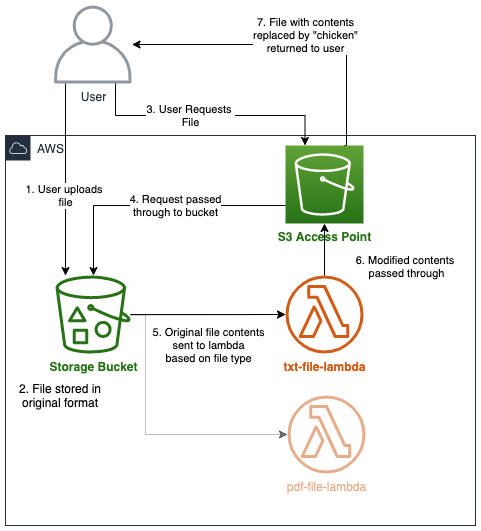

# the-chicken-inator
Stores files, but when retrieving them replaces the words with the word "chicken"

> :warning: **Current Status**: AWS CDK, even CloudFormation doesn't have functionality to add Object Lambda Access Points, so this is paused until that's done...


## BEHOLD MY CHICKEN-INATOR
Retrieving files is a tedious task. All those words - so many words, Perry. So I thought to myself, what if all the words were... CHICKEN. Now when anyone pulls a file from this S3 bucket ALL THE WORDS. WILL BE TURNED. INTO CHICKEN.

## But... why?
AWS came out with this new feature called [Amazon S3 Object Lambda](https://aws.amazon.com/blogs/aws/introducing-amazon-s3-object-lambda-use-your-code-to-process-data-as-it-is-being-retrieved-from-s3/) which intrigued me. Inspired by [this pdf](https://improbable.com/airchives/paperair/volume12/v12i5/chicken-12-5.pdf) my colleague, Chrispy, uses to test things I thought... "well, what if we just made any file we upload be converted to the 'chicken-ized' version of itself?"

Normally I'd do this by triggering a lambda to process the file post-upload, but this time I'm going to do it on retrieval.

## Design


## Getting Started
<details>
    <summary>You will need</summary>
    <p>
        <li>An <a href="https://aws.amazon.com/free/">AWS Account</a> to spin up the resources inside</li>
        <li><a href="https://docs.aws.amazon.com/cdk/latest/guide/getting_started.html">AWS CDK installed</a></li>
        <li><a href="https://docs.aws.amazon.com/cli/latest/userguide/install-cliv2.html">AWS CLI installed</a></li>
        <li>Your AWS CLI configured to use your AWS account</li>
    </p>
</details>

<details>
    <summary>Creating the resources</summary>

    //TODO
</details>

## Get your development space setup

Create the Python Virtual Environment:

```
$ python3 -m venv .venv
```

After the init process completes and the virtualenv is created, you can use the following
step to activate your virtualenv.

```
$ source .venv/bin/activate
```

If you are a Windows platform, you would activate the virtualenv like this:

```
% .venv\Scripts\activate.bat
```

Once the virtualenv is activated, you can install the required dependencies.

```
$ pip install -r requirements.txt
```

## Use it to chicken-ify things

// Gif goes here

// Instructions

## Add more file types

//TODO